```{r setup, include=FALSE}
knitr::opts_chunk$set(echo = TRUE)
library(MASS)
```

# Question 1

## 1a) 
```{r}
plant.heights <- c(173.1, 61.5, 123.3, 100.4, 20.4, 20.9, 228.4, 1.0, 6.8, 11.4,
                   7.7, 40.7, 15.8, 422.4, 58.2, 19.9, 38.8, 121.0, 118.6, 174.9,
                   87.2, 14.0, 204.7, 81.9, 57.3, 177.0, 14.1, 137.0, 76.4, 330.2)
summary(plant.heights)
```
```{r, echo=FALSE}
boxplot(plant.heights, horizontal=TRUE, xlab="Height (cm)")
```
The distribution has a mean around 100 and a median at approximately 69cm, this indicates that the distribution is positively skewed which is confirmed by the box plot. The data points are heavily concentrated at lower values indicating that an exponential distribution could potentially fit this data closely.

## 1b)
```{r}
# No need to include a `start' for the Exponential distribution
exponential.fit <- fitdistr(plant.heights, "exponential")
exponential.fit

```
This estimate is using the alternative form of the exponential distribution where $\lambda = \frac{1}{\theta}$ so the estimate for the rate parameter in the form used on question 1c is $\frac{1}{0.010186757} =$ `r 1/0.010186757`.

## 1c)
```{r}
# Adding 1 to the denominator so that we don't get an Inf when CDF = 1
x <- (1:length(plant.heights)) / (length(plant.heights) + 1)
theoretical.quantiles <- qexp(x, rate = 1/100) # Rate parameter in the format
                                               # that R uses
sorted.plant.heights <- sort(plant.heights)

plot(theoretical.quantiles, sorted.plant.heights, 
     xlab = "Exponential Quantiles", ylab = "Sample Quantiles")

# Fit and plot a Line of Best Fit
fit <- lm(sorted.plant.heights ~ theoretical.quantiles)
abline(fit)

```

The observed data appears to fit very well to the exponential distribution.

## 1d)
Regenerating the plot with
```{r}
theoretical.quantiles <- qexp(x, rate = 1)
```

yields the following plot:

```{r, echo=FALSE}
plot(theoretical.quantiles, sorted.plant.heights, 
     xlab = "Exponential Quantiles", ylab = "Sample Quantiles")

# Fit and plot a Line of Best Fit
fit <- lm(sorted.plant.heights ~ theoretical.quantiles)
abline(fit)

```

From this we can observe that Jen will effectively see the same plot as Tom, since changing the rate parameter of the Exponential distribution simply has the effect of linearly dilating the quantiles from the line $x=0$. The difference is that the slope of Jen's best fitting line will be off from Toms by a factor of 100.

```{r}
lm(sorted.plant.heights ~ theoretical.quantiles)
```
Tells us that Jen's line of best fit will have a y intercept of ~-12.642 and a slope of ~1.172.

# Question 2
## 2a) 
\begin{align*}
f(x | \mu, \lambda) &= \frac{1}{x\sqrt{2 \pi \lambda}} \exp\left( {-\frac{(\ln{x}-\mu)^2}{2 \lambda}} \right) \\
\implies \mbox{Pr}(X_{1}=x_{1}, ... , X_{n}=x_{n} | \mu, \lambda) &= \prod_{i=1}^{n} \left[ \frac{1}{x_{i}} \right] \frac{1}{\sqrt{2 \pi \lambda}^n} \exp\left( {-\frac{\sum_{i=1}^{n}(\ln{x_{i}}-\mu)^2}{2 \lambda}} \right) \\
\mbox{L}(\mu, \lambda) &= \prod_{i=1}^{n} \left[ \frac{1}{x_{i}} \right] \frac{1}{\sqrt{2 \pi \lambda}^n} \exp\left( {-\frac{\sum_{i=1}^{n}(\ln{x_{i}}-\mu)^2}{2 \lambda}} \right) \\
\ln(\mbox{L}(\mu, \lambda)) &= -\sum_{i=1}^{n} \ln{x_{i}} + \ln \left( \frac{1}{\sqrt{2 \pi \lambda}^n} \right) -\frac{\sum_{i=1}^{n}(\ln{x_{i}}-\mu)^2}{2 \lambda} \\
\frac{\partial \ln(\mbox{L}(\mu, \lambda))}{\partial \mu} &= \frac{\sum_{i=1}^{n}(\ln{x_{i}}-\mu)}{\lambda} = 0 \\
\implies n \mu &= \sum_{i=1}^{n}\ln{x_{i}} \\
\implies \hat{\mu} &= \frac{1}{n} \sum_{i=1}^{n}\ln{X_{i}} \quad \blacksquare
\end{align*}

\begin{align*}
\ln(\mbox{L}(\mu, \lambda)) &= -\sum_{i=1}^{n} \ln{x_{i}} - \frac{n}{2} \ln \left(2 \pi \lambda \right) -\frac{\sum_{i=1}^{n}(\ln{x_{i}}-\mu)^2}{2 \lambda} \\
\frac{\partial \ln(\mbox{L}(\mu, \lambda))}{\partial \lambda} &= -\frac{n}{2} \frac{1}{\lambda} + \frac{\sum_{i=1}^{n}(\ln{x_{i}}-\mu)^2}{2 \lambda^{2}} = 0 \\
n \lambda &= \sum_{i=1}^{n}(\ln{x_{i}}-\mu)^2 \\
\implies \hat{\lambda} &= \frac{1}{n} \sum_{i=1}^{n}(\ln{X_{i}}-\hat{\mu})^2 \quad \blacksquare
\end{align*}

## 2bi)
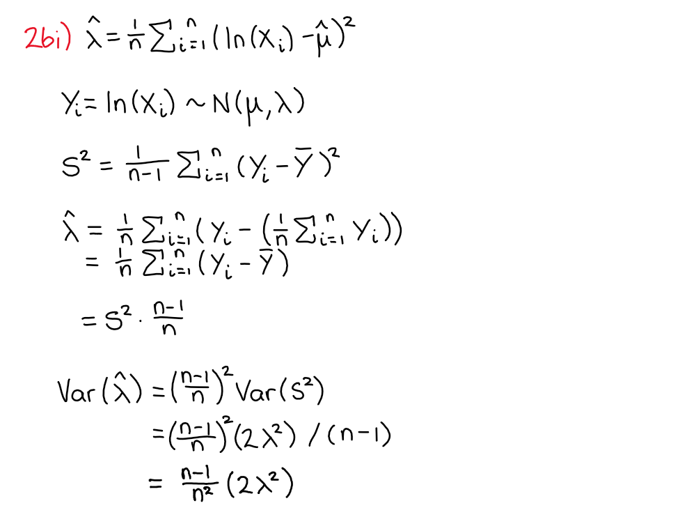

## 2bii)
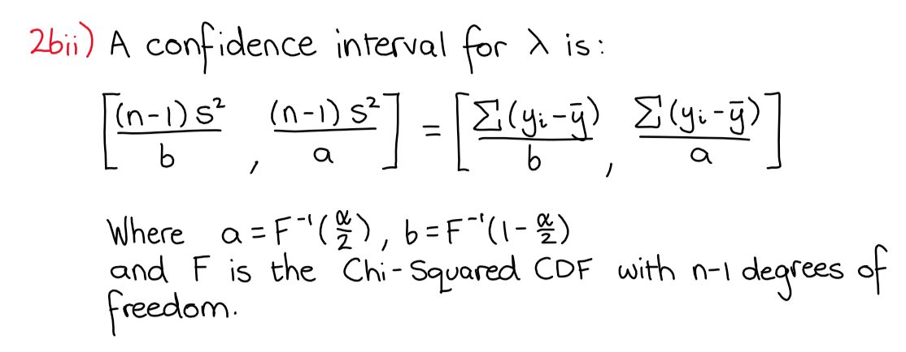

## 2ci)
```{r}
data <- c(12.9, 2.3, 2.4, 65.0, 6.7, 1.8, 1.5, 1.7, 
          248.7, 1.0, 2.0, 4.9, 3.6, 4.1, 6.8)

mu.hat <- sum(log(data))/length(data)
lambda.hat <- sum((log(data)-mu.hat)^2)/length(data)

variance <- ((length(data) - 1) / length(data)^2) * 2 * lambda.hat^2
standard.error <- sqrt(variance)

standard.error
```
## 2cii)
```{r}
lambda.hat
# 0.975 and 0.025 for the 95% CI
conf.interval <- c(((length(data) - 1) * standard.error^2) /
                     qchisq(0.975, (length(data) - 1)),
                   ((length(data) - 1) * standard.error^2) /
                     qchisq(0.025, (length(data) - 1)))
conf.interval
```

# Question 3
## 3ai)
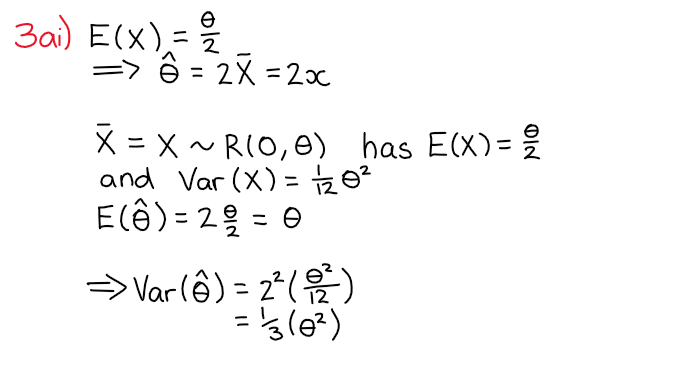

## 3aii)
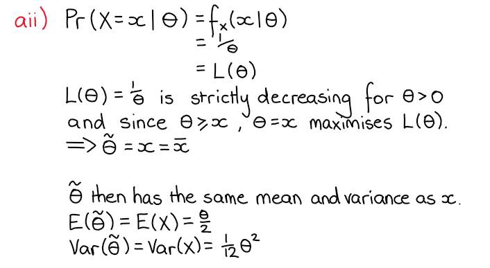

## 3bi)
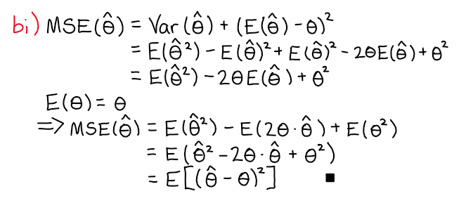

## 3bii)
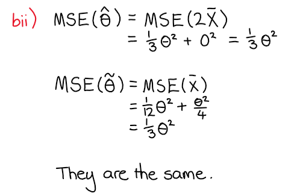

## 3biii)
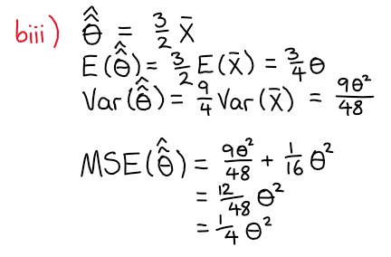

## 3ci)
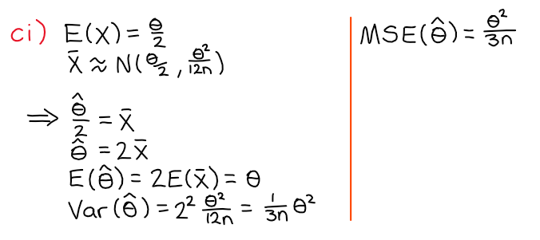

## 3cii)
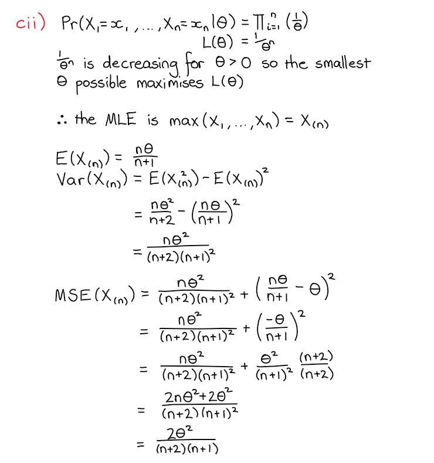

## 3ciii)


# Question 4
```{r}
sample.size <- 20
ntrials <- 1000
sample.means <- 1:ntrials
sample.midranges <- 1:ntrials

for (i in 1:ntrials) {
  x <- rnorm(sample.size)
  sample.means[i] <- mean(x)
  sample.midranges[i] <- (max(x) + min(x)) / 2
}

mean(sample.means)
mean(sample.midranges)
sd(sample.means)
sd(sample.midranges)
```
These values show that the mean of both estimators for the population mean are equal to the population mean, indicating that they are unbiased. The variance of the sample mean is, however, much lower than the variance of the average of the minimum and maximum values. This box plot confirms these claims (the magenta line is plotted at the true population mean).

```{r, echo=FALSE}
boxplot(sample.means, sample.midranges, names = c("X-bar", "Average of Min / Max"), 
        horizontal = TRUE)
abline(v = 0, lty = 2, lwd = 2, col = "magenta")
```

# Question 5
## 5a) 
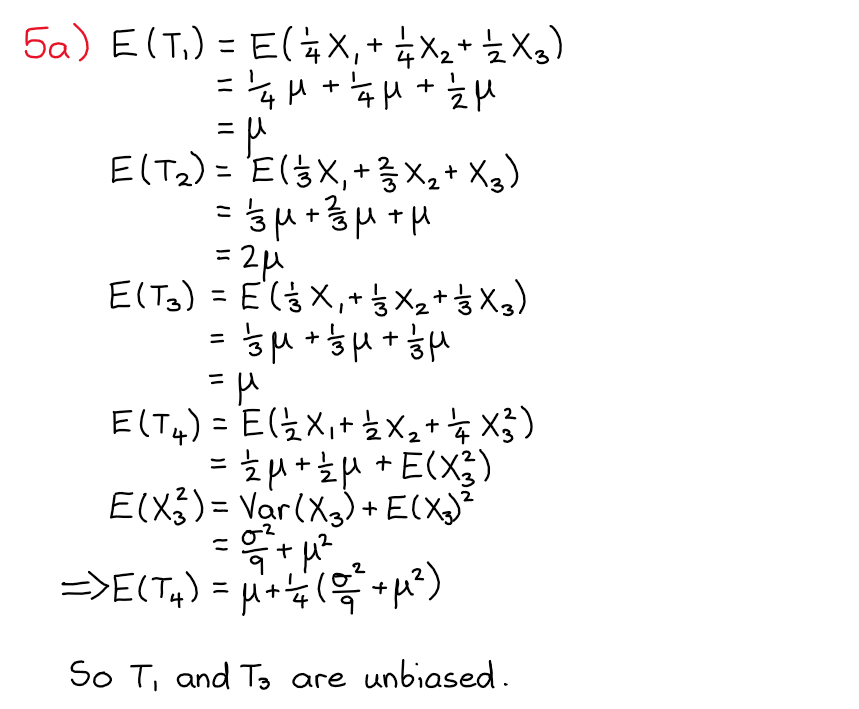

## 5b)
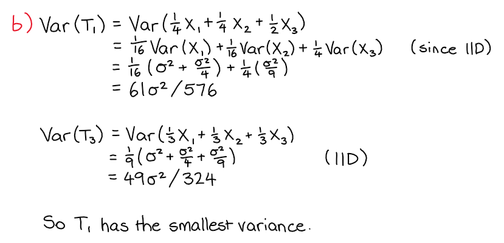

## 5c)
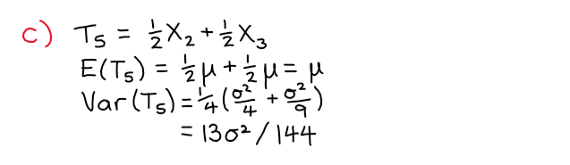

