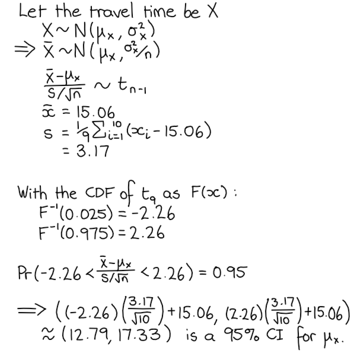
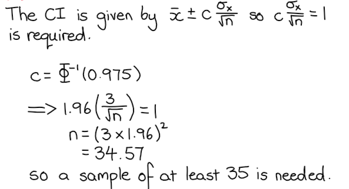
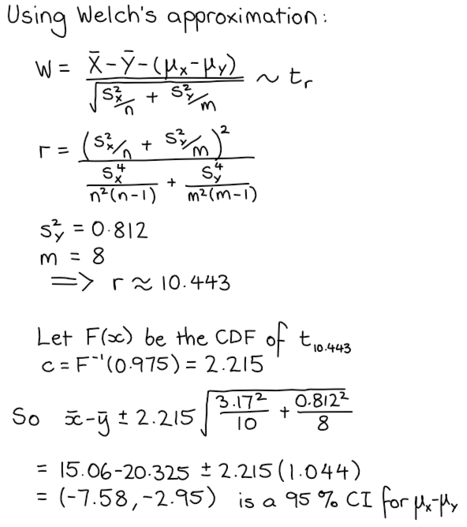
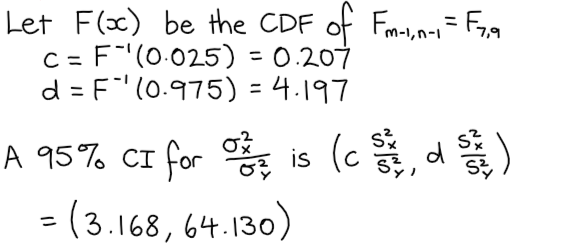
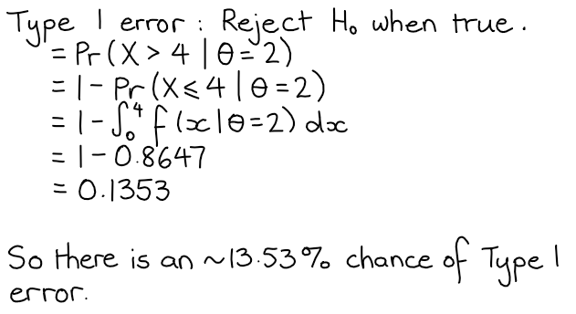
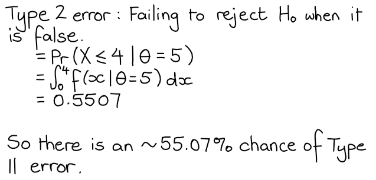
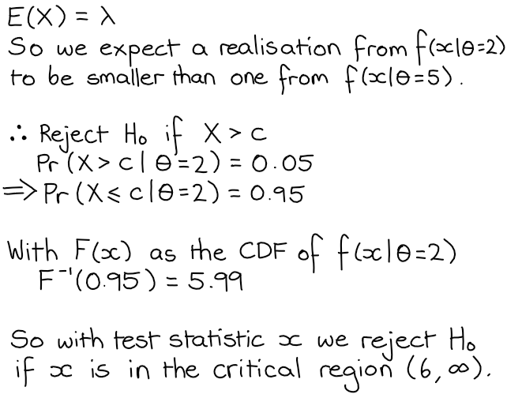

```{r setup, include=FALSE}
knitr::opts_chunk$set(echo = TRUE)
```
# Question 1
## 1a)
\begin{align}
  H_{0} &: p_{1} = p_{2}\\
  H_{1} &: p_{1} \neq p_{2}
\end{align}

## 1b)
```{r}
y <- c(520, 600)
n <- c(800, 1000)

prop.test(y, n, alternative = "two.sided")
```
The p-value for this test is 0.03357, therefore there is enough evidence to reject $H_{0}$ at the 0.05 significance level.

## 1c)
```{r}
prop.test(y, n, alternative = "two.sided", conf.level=0.95)$conf.int
```
$(0.00399, 0.0960)$ is a 95% confidence interval for $p_{1} - p_{2}$.

# Question 2
## 2a)


## 2b)


## 2c)


## 2d)


## 2e)
```{r}
X <- c(12.1, 12.2, 17.4, 13.1, 17.8, 19.8, 13.0, 10.8, 18.4, 16.0)
Y <- c(20.1, 21.3, 20.4, 21.7, 20.3, 19.5, 19.4, 19.9)

var.test(X, Y)$conf.int
```
This shows the same confidence interval as 2d; $\approx (3.168, 64.130)$.

# Question 3
```{r}
coffee <- read.table("coffee.txt", header=TRUE)
```
## 3a)
```{r}
s.c.reg <- lm(sales ~ customer, data=coffee)
s.c.reg
```
So the coefficients are $\alpha = -32.34$ and $\beta = 6.40$.

## 3b)
To find a 95% CI for the coefficients of the model:
```{r}
confint(s.c.reg)
```
So a 95% CI for $\alpha$ is $(-163.027, 98.339)$, and a 95% CI for $\beta$ is $(5.067,  7.734)$.

## 3c)
```{r}
cust.100 <- data.frame("customer" = 100)
predict(s.c.reg, newdata = cust.100, interval = "confidence")
```
So $(576.73, 638.68)$ is a 95% CI for the mean when the number of customers is 100.

## 3d) 
```{r}
predict(s.c.reg, newdata = cust.100, interval = "prediction")
```
So $(468.49, 746.91)$ is a 95% prediction interval for the number of sales when the number of customers is 100.

## 3e)
The regular regression model assumptions are that the magnitude of the residuals is independent of the fitted value, and that the residuals are normally distributed.
```{r, echo=FALSE}
par(mar = c(4, 4, .1, .1))
```
```{r, figures-side, fig.show="hold", out.width="50%"}
plot(s.c.reg, 1:2)
```
The left plot shows that the size of the residuals does not seem to be dependent on the fitted value, so the assumption of homoscedasticity is valid, though it's hard to be confident with the relatively small data set. The QQ-plot on the right shows that the residuals do indeed seem to be normally distributed. Therefore the usual regression model assumptions are appropriate.

# Question 4
$$\bar{X} \sim \mbox{N}\left( \mu, \frac{\sigma^{2}}{n} \right)$$

## 4a)
$$(\bar{X} - \mu) \sim \mbox{N}\left( 0, \frac{\sigma^{2}}{n} \right)$$
So $\bar{X} - \mu$ is not a pivot since it's distribution depends on $\sigma$.

## 4b)
$$\frac{\bar{X} - \mu}{\sigma / \sqrt{n}} \sim \mbox{N}\left( 0, 1 \right)$$
So $\frac{\bar{X} - \mu}{\sigma / \sqrt{n}}$ is a pivot since it's distribution does not depend on $\mu$ or $\sigma$.

## 4c)
$$\frac{\bar{X} - \mu}{S / \sqrt{n}} \sim t_{n-1}$$
So $\frac{\bar{X} - \mu}{S / \sqrt{n}}$ is a pivot since it's distribution does not depend on $\mu$ or $\sigma$.

## 4d)
$$\frac{\bar{X} - \mu}{S} = \frac{1}{\sqrt{n}} \frac{\bar{X} - \mu}{S / \sqrt{n}}$$
Since it has been shown that $\frac{\bar{X} - \mu}{S / \sqrt{n}}$ is a pivot, and multiplying by $\frac{1}{\sqrt{n}}$ simply dilates the distribution by a factor of $\sqrt{n}$ (and doesn't reintroduce either of the parameters), $\frac{\bar{X} - \mu}{S}$ is also a pivot.

# Question 5
## 5a)


## 5b)


## 5c)


## 5d)

