```{r setup, include=FALSE}
knitr::opts_chunk$set(echo = TRUE)
```

# Question 1
## 1a)
\begin{align*}
H_{0}&: m = 15\\
H_{1}&: m < 15
\end{align*}
We will reject $H_{0}$ if the proportion of days with a count below 15 is large enough.
```{r}
cases <- c(48, 70, 47, 40, 35, 41, 30,
           39, 41, 25, 44, 20, 13, 11,
           28, 14, 11, 13, 12, 16, 5)
n.under.15 <- sum(cases < 15)
binom.test(n.under.15, length(cases),
           alternative = "greater", conf.level = 0.95)
```
Since the p-value of the test is 0.9608 there is a low chance that this data came from a distribution with a median below 15, so we have insufficient evidence to reject the null.

## 1b)
Let $m_{2}$ be the median of the 2nd week and $m_{3}$ be the median of the third week.
\begin{align*}
H_{0}&: m_{2} - m_{3} = 0\\
H_{1}&: m_{2} - m_{3} > 0
\end{align*}
We will reject the null hypothesis if scores in the 2nd week are significantly higher than in the third week.
```{r}
week.2 <- cases[8:14]
week.3 <- cases[15:21]

wilcox.test(week.2, week.3, 
            alternative = "greater", conf.level = 0.95,
            exact = FALSE)
```
Since the p-value of the test is 0.04798 there is just sufficient evidence to reject the null hypothesis at a 0.05 level of significance.

# Question 2
## 2a)
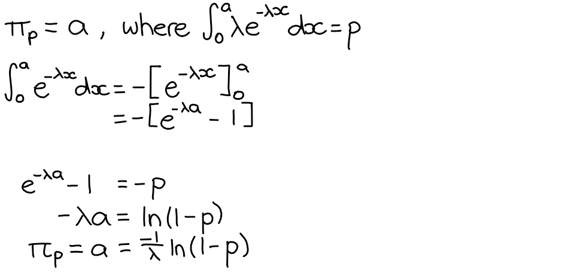

## 2b)
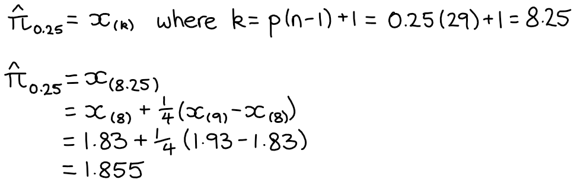

## 2c)
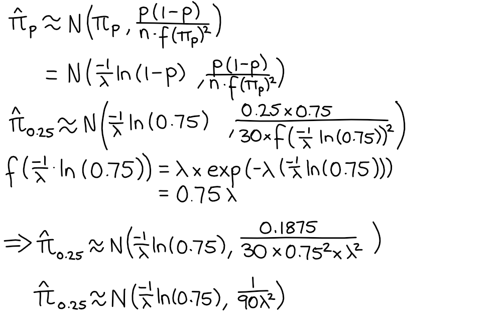

## 2d)
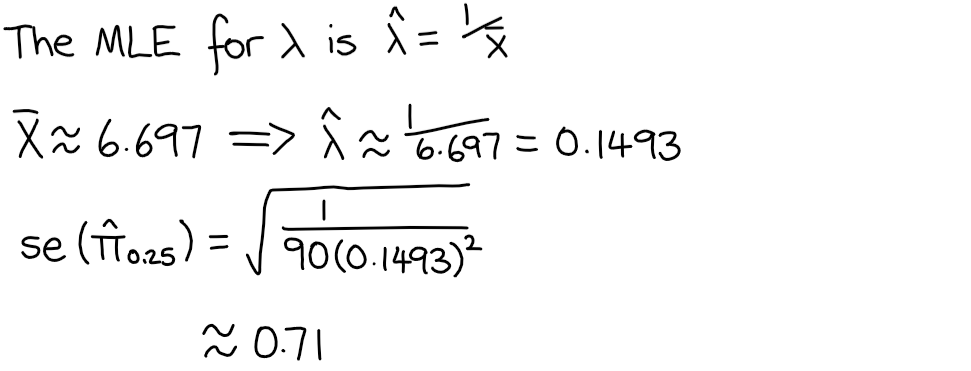

\newpage

# Question 3
## 3a)
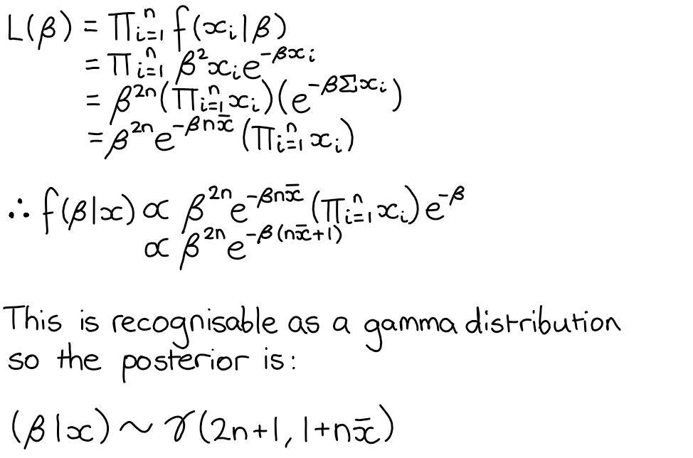

## 3b)
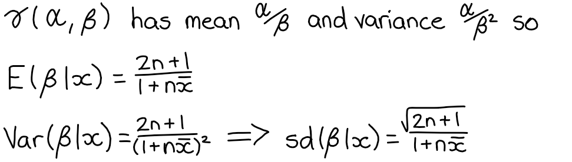

\newpage 

# Question 4
## 4a)
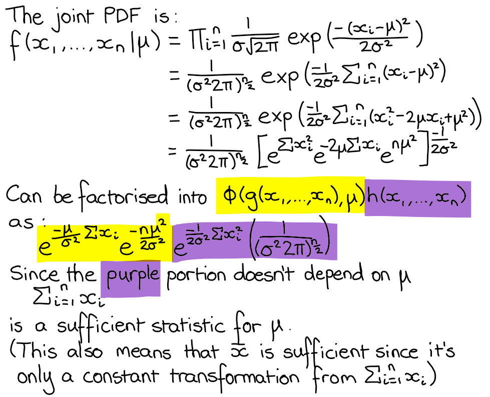

## 4b)
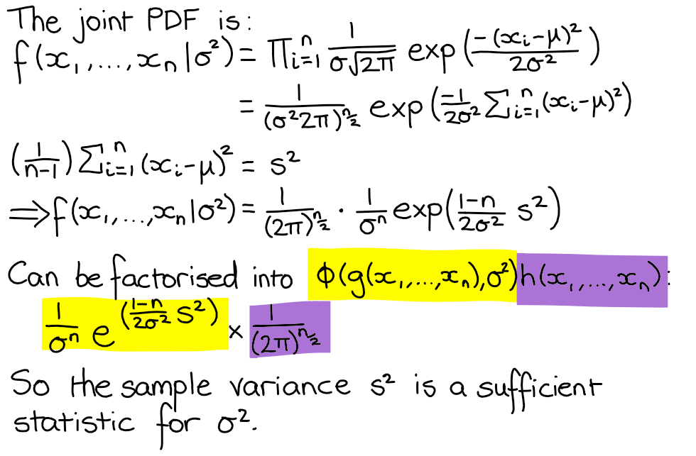

## 4c)
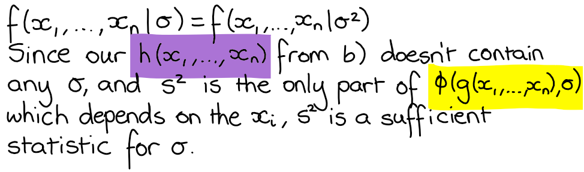

\newpage

# Question 5
## 5a)
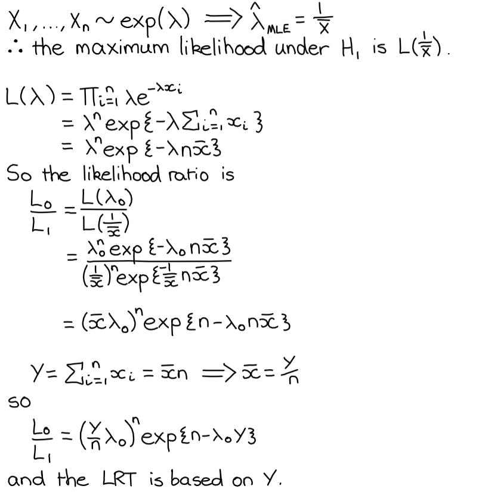

## 5b)
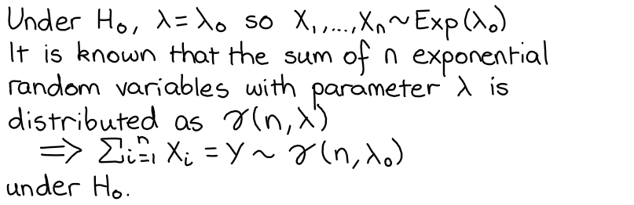

## 5c)
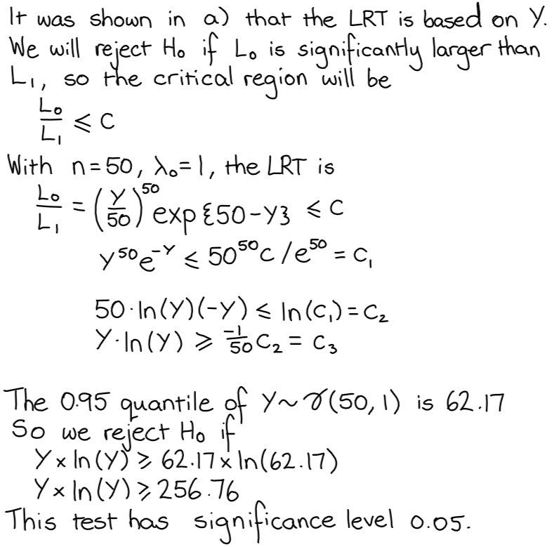

